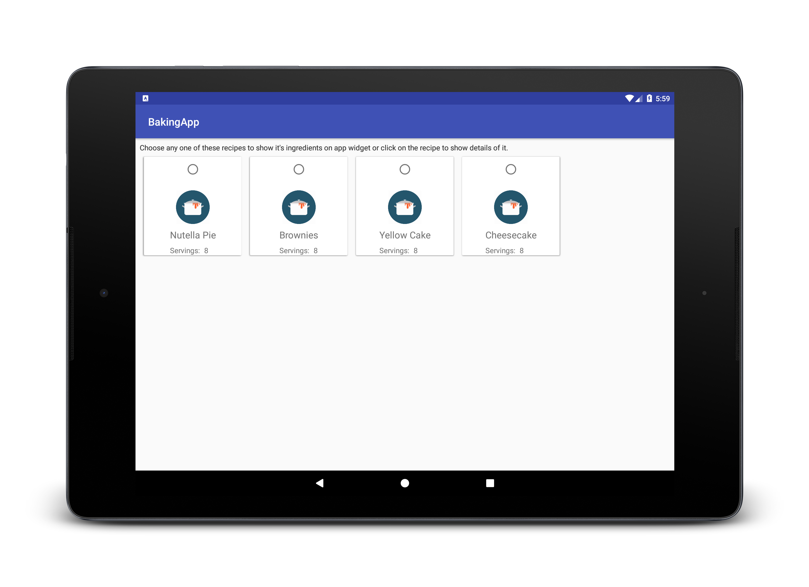

# Baking App

Here is a fully functional and colorful android app which I made from scratch for Android Developer Nanodegree program. This app reveals the power of adaptive UI both for phone and tablet devices. 
This app will allow Udacity’s resident baker-in-chief, Miriam, to share her recipes with the world. 
It will also allow a user to select a recipe and see video-guided steps for how to complete it.

### Features:

  - Discover the recipes of Miriam
  - Step by step guide
  - Watch videos for the steps
  - Material design
  - Adaptive UI for both phone and tablet
  - Widget for ingredients

## Screenshots

### Phone Device

### Tablet Device

### Widget

## Libraries

* [ButterKnife] - Field and method binding for Android views
* [ExoPlayer] - An extensible media player for Android
* [Glide] - An image loading and caching library for Android focused on smooth scrolling 
* [Gson] - A library to convert Java Objects into JSON and back
* [Moshi] - A modern JSON library for Android and Java.

Developer setup
---------------
### Requirements

  - Java 8
  - Latest version of Android SDK and Android Build Tools

### Building
You can build the app with Android Studio or with ./gradlew assembleDebug command.

License
-------

    Copyright 2017 Parag Pawar

    Licensed under the Apache License, Version 2.0 (the "License");
    you may not use this file except in compliance with the License.
    You may obtain a copy of the License at

       http://www.apache.org/licenses/LICENSE-2.0

    Unless required by applicable law or agreed to in writing, software
    distributed under the License is distributed on an "AS IS" BASIS,
    WITHOUT WARRANTIES OR CONDITIONS OF ANY KIND, either express or implied.
    See the License for the specific language governing permissions and
    limitations under the License.

[ButterKnife]: <http://jakewharton.github.io/butterknife/>
[ExoPlayer]: <https://github.com/google/ExoPlayer>
[Glide]: <https://bumptech.github.io/glide/>
[Gson]: <https://github.com/google/gson>
[Moshi]: <http://square.github.io/moshi/1.x/moshi/>
